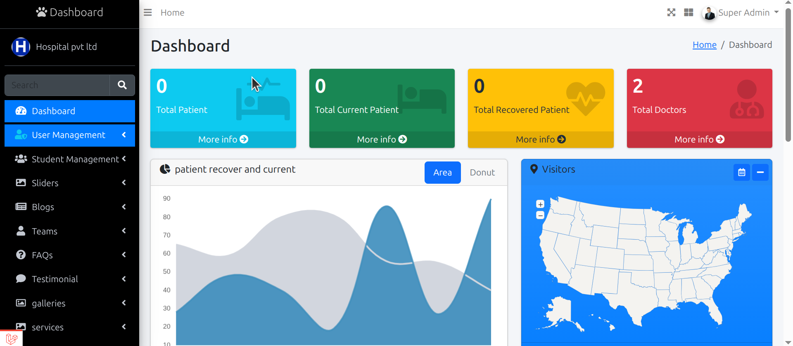
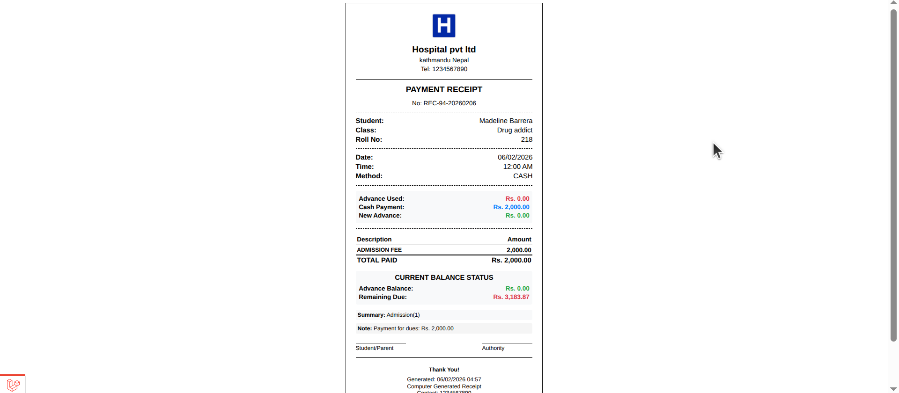
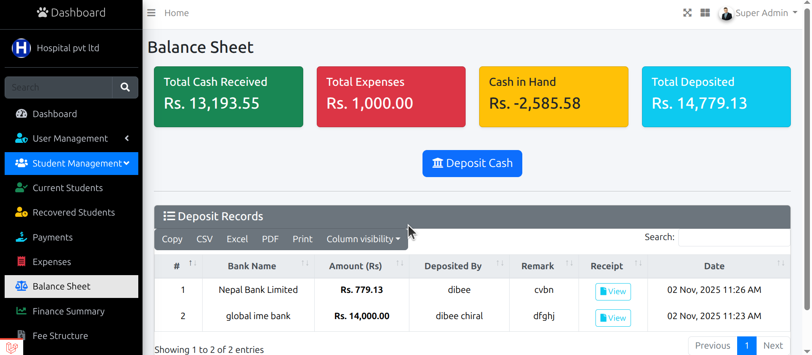
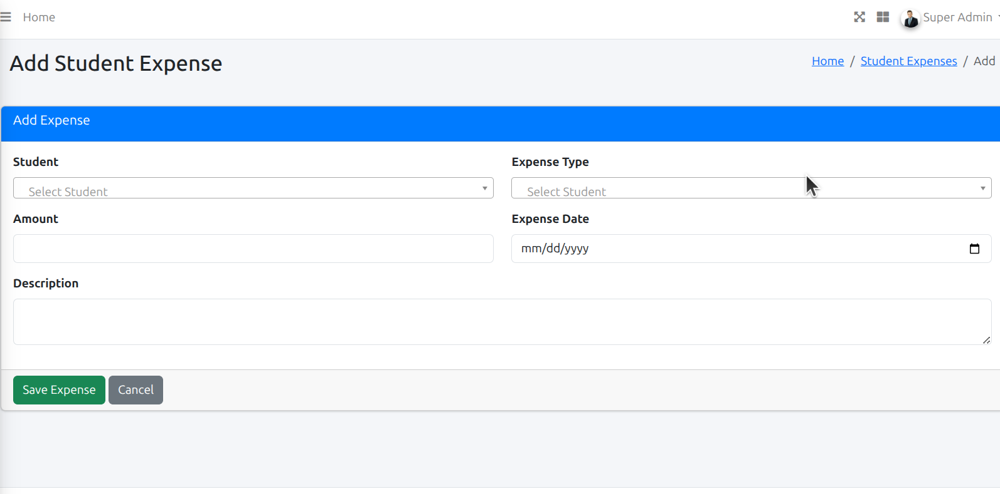
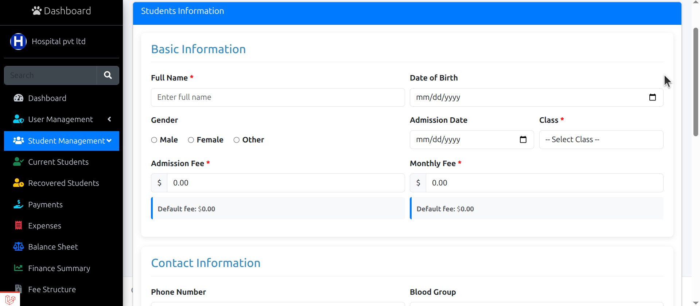
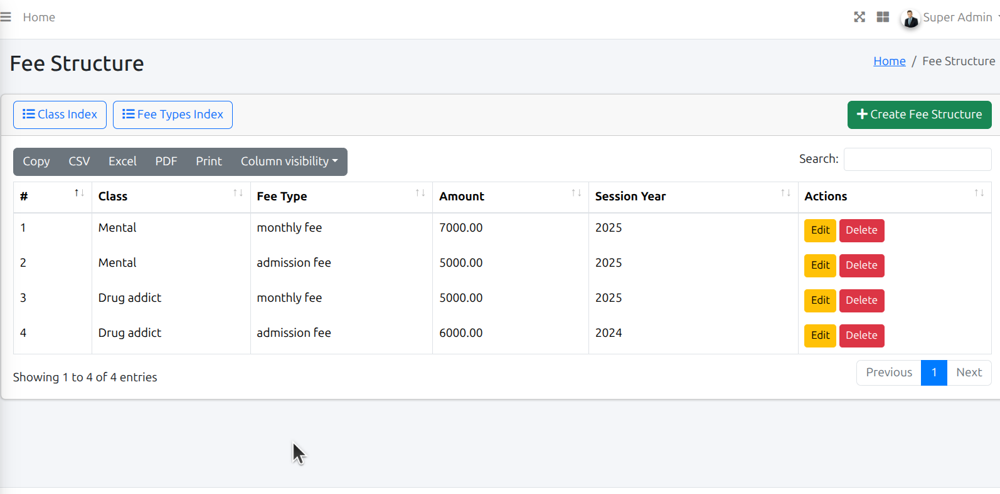
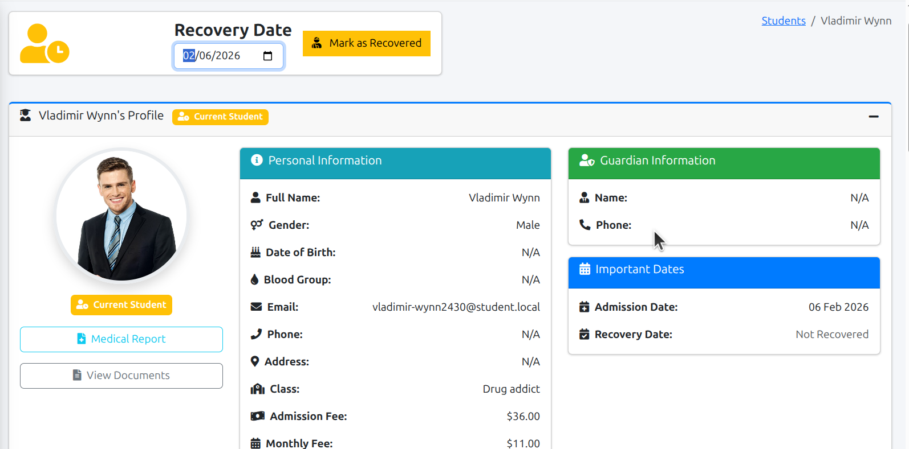
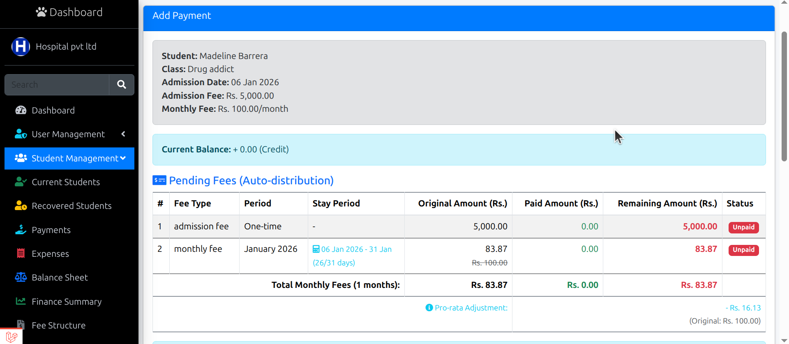
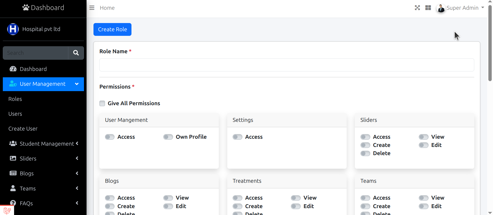

🏥 Rehabilitation Hospital Management System

📌 Overview
This project is a Rehabilitation Hospital Management System designed to manage patients undergoing long-term recovery programs.

The system helps hospitals track patient details, recovery duration, monthly payments, and treatment-related expenses using a clean frontend and a secure backend.

This application demonstrates real-world healthcare workflow handling and full-stack web development skills.

🚀 Key Features

👤 Patient Management
-Patient registration and profile management
-Recovery period tracking
-Status monitoring during rehabilitation

💳 Billing & Payments
-Monthly fee management for admitted patients
-Expense tracking during recovery
-Payment records and history

📊 Hospital Operations
-Centralized data management
-Secure backend logic for hospital workflows
-Scalable structure for future enhancements

🛠 Tech Stack
#Frontend
-HTML5
-CSS3
-JavaScript
-Bootstrap

#Backend
-Laravel (PHP Framework)
-MySQL Database

🔒 Security Notice
This repository is shared for demonstration and portfolio purposes only.
-Sensitive configuration files (.env)
-Database credentials
-Production data

are intentionally excluded.

🎯 Purpose of This Project
-This project was built to demonstrate:
-Real-world hospital management logic
-Backend development using Laravel
-Frontend integration with backend APIs
-Payment and expense tracking workflows

It serves as a portfolio project to build client trust and showcase practical application development skills.

📁 Project Structure
rehabilitation-hospital/
├── backend/    (Laravel application)
├── frontend/   (HTML, CSS, JS, Bootstrap)
└── README.md

✅ Status
✔ Core features implemented
✔ Frontend & backend integrated
✔ Ready for demonstration

## 📸 Screenshots

### 🏠 Dashboard

### 🧾 Bill

### 📊 Balance Sheet

### 💰 Expenses

### 👤 Add Patient

### 🧱 Fees Structure

### 👤 Patient Details

### 💳 Payment

### 🔐 Roles & Permissions

